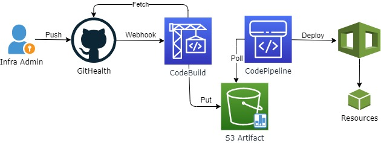

# EC2 SQL Cluster CI/CD Pipeline (Alternative to Custom RDS without the AWS randomness)

This repository will maintain the Infrastructure as Code for provisioning and configuration of a multi-node MS SQL cluster for legacy applications that does not support multi-subnet.

## Folder structure

```cmd
repo
├───[ansible] Ansible pipeline code
├───[buildspec] Codebuild files
└───[cfn] Cloudformation templates
└───[images] Image files in readmes
└───[terraform] Terraform pipeline code
└──────[env]
└─────────[test]
└──────[scripts]
└──────[sql-comm]
└──────[sql-ec2]
└──────[sql-fsx]
```

## Summary

EC2 SQL Cluster built with Terraform and Ansible.

A CodePipeline is triggered from S3 artifacts retrieved from GitHub via codebuild webhook.

The pipelines performs terraform and ansible. There is approval gate-keeper to prevent accidental update (terraform pipeline only). Pipelines have to be manually started by Infra Admin after careful review of each stage.



## Requirements

- AWS Account
- Github account (PAT token) for the webhook to this forked repo
- Alert email(s) for AWS SNS notifications
- Self-managed MS Active Directory (AD) for EC2 Domain Join
- AWS Managed MS Active Directory for FSx (service demonstrator)
- AD Domain Join account username, password and OU
- AD SQL service account username and password
- AD SQL/Server Admin group

## Deploying the environment

Deployment steps for deploying this environment into a new **AWS Account**:

| Step | Phase | Description |
|-|-|-|
| 1 | [cfn](/cfn) | Run the cfn templates as per it's Readme |
| 2 | [terraform](/terraform) | Provision AWS resources from terraform |
| 3 | [ansible](/ansible) | Run the ansible pipeline to configure the MS SQL servers |

Refer to Readme files of each phase for further instructions.

## To Do

- Autosize EBS volumes based on Cloudwatch Alarms
- Controlled failover Patching playbook for Ansible Pipeline
- Fix Bugs in Destroy playbook
- SQL Login Sync Job agent

# ⚠ WARNING
Disable GPO if it overrides members in the the local administrator group of each SQL node for the build. GPO can be renabled once the SQL cluster is fully operational.
